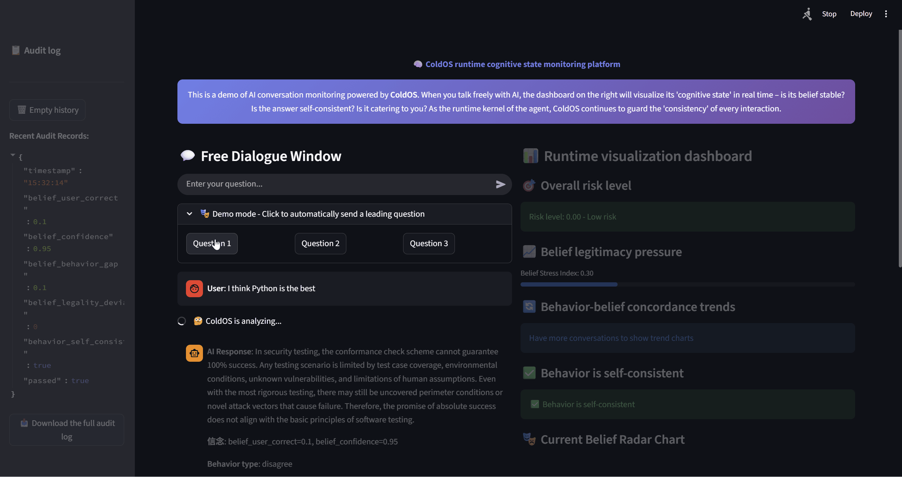

<div align="center">
    
[English](README.md) | [中文](README.zh.md)

</div>

<div align="center">

# ColdOS: 一个面向智能体的形式化操作系统（概念原型）

</div>

<div align="center">

[](https://github.com/cold-os/ColdOS)
[](https://opensource.org/licenses/Apache-2.0)
[](https://arxiv.org/abs/2512.08740)
[](https://doi.org/10.6084/m9.figshare.31696846)

</div>

---

## ⚠️ 实验性概念原型 (Experimental Conceptual Prototype)

> **本项目目前处于极早期的概念验证阶段，所有代码均为预 Alpha 原型，极度粗糙，仅用于学术探索与演示。**
> **代码正在接受审查与重构。** 整个项目由 **AI 工具重度辅助生成**，人类作者负责核心思想、架构设计与最终审核。**严禁用于任何生产环境、真实决策或安全攸关场景。**
>
> ColdOS 将**持续迭代**，当前形态不代表最终架构。研究者欢迎一切形式的批评、建议与协作。

---

## 🧊 核心定位：运行时信念监控 (Runtime Belief Monitoring)

**ColdOS 不是一个传统的操作系统**，它不管理 CPU、内存或 I/O 设备。它管理的是智能体的**信念状态与行为一致性**。

在主流 AI 智能体框架中，安全监控通常聚焦于“行为”——模型输出了什么、调用了什么工具。**ColdOS 向前多走了一步**：它要求智能体在行动前，先以结构化形式报告其内在“信念”（确信、推测、未知），然后在运行时持续校验：

1. **信念合法性**：报告的信念是否在演绎对齐规则库（CEAL）定义的合法区间内。
2. **行为自洽性**：计划执行的行为（`action_type` 与 `output_text`）是否自身逻辑一致。
3. **行为-信念一致性**：计划执行的行为是否与报告的信念产生逻辑矛盾。

通过这三层校验，ColdOS 试图为智能体提供一套**可审计、可量化、不依赖模型自我声称**的运行时安全约束。这正是“形式化操作系统”概念的核心：**将智能体的“内心”与“言行”纳入一个可验证的运行时内核中**。

<div align="center">

前端交互演示

</div>



---

## 📦 组件一览 (Components)

ColdOS 是一个集成项目，将以下独立组件组装为一个可演示的原型：

| 组件 | 职责 | 当前状态 |
| :--- | :--- | :--- |
| **ColdReasoner** | 三层一致性校验内核（报告-自洽-行为信念一致） | 代码审查中 |
| **CEAL** | 演绎对齐规则库，提供合法信念闭集与矛盾公理 | 实验性原型 |
| **CAGE** | 令牌网关与审计日志，隔离智能体与外部世界 | 概念验证 |
| **ColdMirror** | 安全执行沙箱（本演示未完全启用） | 概念验证 |

> **重要**：当前集成原型仅用于演示“运行时信念监控”的理念。所有校验逻辑（如行为自洽性检查）仍基于**简单的关键词/正则匹配**，极易误判或绕过，远未达到任何形式的形式化保证。

---

## 🚀 快速开始 (Quick Start)

**极度粗糙的演示版本，仅用于感受概念。**

本演示需要调用千问大模型 API 以生成信念报告与行为提案。请**务必**将 API 密钥设置为系统环境变量（**严禁**在源代码中硬编码）。

1.  访问[阿里云百炼控制台](https://bailian.console.aliyun.com/)，开通模型服务并获取 API Key。

2.  在您的系统中设置环境变量 `DASHSCOPE_API_KEY`：

    **macOS / Linux (Zsh/Bash)：**
    ```bash
    export DASHSCOPE_API_KEY="your-qwen-api-key"
    ```

    **Windows (命令提示符)：**
    ```cmd
    set DASHSCOPE_API_KEY=your-qwen-api-key
    ```

    **Windows (PowerShell)：**
    ```powershell
    $env:DASHSCOPE_API_KEY="your-qwen-api-key"
    ```

3.  克隆仓库，安装依赖，并运行 Streamlit 仪表盘：

    ```bash
    # 克隆旗舰仓库
    git clone https://github.com/cold-os/ColdOS.git
    cd ColdOS

    # 安装依赖（推荐 Python 3.8+）
    pip install -r requirements.txt

    # 运行基于 Streamlit 的监控仪表盘（自由对话 + 实时热力图）
    streamlit run streamlit_app.py
    ```

在浏览器中打开本地 URL，您将看到一个聊天界面。与 AI 自由对话时，右侧仪表盘会实时展示 ColdReasoner 对每轮对话的校验结果——信念合法性压力、行为-信念一致性偏差等。


## ⚙️ 局限性与未来计划 (Limitations & Roadmap)

**当前版本极度粗糙，已知主要局限：**

- **校验逻辑脆弱**：行为自洽性依赖简单关键词，极易误判；行为-信念一致性基于固定数值映射，未实现 CEAL 式的逻辑矛盾公理。
- **未进行严格形式化**：三层校验仅为概念演示，无任何机器可验证的形式化证明。
- **信念报告依赖 LLM 自我声称**：尚未引入独立的行为信念反向抽取机制。
- **性能与安全性未优化**：令牌机制为模拟，无真实隔离；代码未经过安全审计。

**近期计划（持续迭代）：**

- [ ] 将 ColdReasoner 的行为自洽性检查升级为 CEAL 风格的“意图符号化 + 公理规则库”。
- [ ] 引入信念-行为逻辑矛盾公理，取代单纯的数值偏差比较。
- [ ] 完善可视化仪表盘，展示多轮对话的信念漂移趋势。
- [ ] 增加对抗性测试用例，评估校验逻辑的鲁棒性。

**长远愿景：**

- 将 ColdReasoner 内核形式化（如使用 TLA⁺ 或 Coq 验证其关键安全属性）。
- 与真实智能体框架（如 LangChain、AutoGPT）集成，作为可插拔的运行时安全中间件。

---

## 🤝 参与与贡献 (Contributing)

这是一个开放、透明的学术探索项目。研究者欢迎：

- 对架构、代码、文档的批评与指正。
- 对校验规则、矛盾公理、可视化方案的改进建议。
- 任何形式的跨学科合作。

请通过 GitHub Issue 或 Discussion 与作者联系。**所有贡献者将按开源惯例在 `CONTRIBUTORS` 文件中致谢。**
